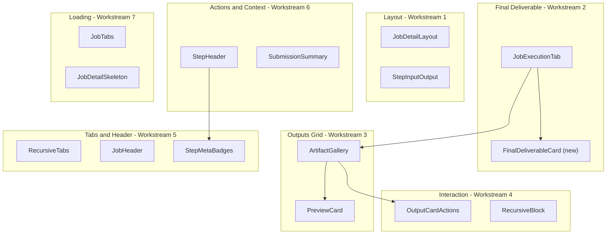

# Execution Tab UX Overhaul

The fixes are grouped into 7 workstreams ordered by impact. Each workstream addresses multiple issues from the audit.

---

## 1. Widen the Page Layout (Issues 2, 11)

**Problem:** `JobDetailLayout` double-constrains to `max-w-3xl` inside `max-w-7xl`, wasting ~60% of desktop width and forcing nested scrolling.

**Current state:**

- [Narrow layout + nested scrolling](https://cc360-pages.s3.us-west-2.amazonaws.com/ux-audit/execution-tab/flaw-02-narrow-layout-and-06-tabs-and-12-header.png)
- [Nested scrolling in expanded view](https://cc360-pages.s3.us-west-2.amazonaws.com/ux-audit/execution-tab/flaw-11-nested-scrolling-expanded.png)

**File:** [frontend/src/components/dashboard/JobDetailLayout.tsx](frontend/src/components/dashboard/JobDetailLayout.tsx)

- Change the inner constraint from `max-w-3xl` to `max-w-5xl` (1024px). This gives substantially more room for the timeline and artifact grid while still keeping content readable and centered.
- In [frontend/src/components/jobs/StepInputOutput.tsx](frontend/src/components/jobs/StepInputOutput.tsx), remove the `max-h-[350px] md:max-h-72` cap on compact step content. Replace with a softer `max-h-[600px]` with a fade-to-"show more" affordance so content is not arbitrarily cut off but also does not make the page infinitely long.

---

## 2. Promote the Final Deliverable (Issues 1, 4, 10)

**Problem:** The final output is just one of 12 undifferentiated cards. Users must hunt for it.

**Current state:**

- [Final deliverable buried at bottom-right of grid](https://cc360-pages.s3.us-west-2.amazonaws.com/ux-audit/execution-tab/flaw-01-final-deliverable-buried.png)
- [Weak "View Output" CTA cramped in card footer](https://cc360-pages.s3.us-west-2.amazonaws.com/ux-audit/execution-tab/flaw-05-10-tiny-buttons-weak-cta.png)

**File:** [frontend/src/components/jobs/detail/JobExecutionTab.tsx](frontend/src/components/jobs/detail/JobExecutionTab.tsx)

- Split `artifactGalleryItems` into two groups: `finalDeliverable` (items with `kind === "jobOutput"`) and `otherArtifacts`.
- Render a **hero card** above the `ArtifactGallery` grid for the final deliverable. It should be full-width, show a larger preview thumbnail, a prominent "View Output" primary button, and "Copy Link" / "Download" as secondary icon actions.
- Create a new `FinalDeliverableCard` component in [frontend/src/components/jobs/detail/](frontend/src/components/jobs/detail/) that accepts an `ArtifactGalleryItem` and renders this hero treatment.
- Pass only `otherArtifacts` to the existing `ArtifactGallery` grid below.

---

## 3. Improve the Outputs Grid (Issues 4, 8, 9)

**Problem:** All 12 artifacts share identical card treatment; duplicate images dominate; cards are too small to read.

**Current state:**

- [No hierarchy, small cards, duplicate images dominating](https://cc360-pages.s3.us-west-2.amazonaws.com/ux-audit/execution-tab/flaw-01-04-08-09-10-outputs-grid.png)

**Files:**

- [frontend/src/components/jobs/detail/ArtifactGallery.tsx](frontend/src/components/jobs/detail/ArtifactGallery.tsx)
- [frontend/src/components/artifacts/PreviewCard.tsx](frontend/src/components/artifacts/PreviewCard.tsx)

Changes:

- **Group by step:** Add sub-headings to the grid (e.g., "Step 1: Deep Market & Competitive Intelligence", "Step 3: ICP Deliverable + Brand Assets") so artifacts are visually organized.
- **Collapse duplicate images:** Extend the existing `groupFinalHtmlArtifacts` function to also group image artifacts from the same step. Show the latest image with a `+3 variants` badge instead of 4 near-identical cards.
- **Widen cards:** Change the grid from `sm:grid-cols-2 lg:grid-cols-3 xl:grid-cols-4` to `sm:grid-cols-2 lg:grid-cols-3` (max 3 columns). This gives each card more room for readable titles and descriptions.
- **Increase card text size:** In `PreviewCard`, change the title from `text-xs` to `text-sm`, and the description from `text-[10px]` to `text-xs`.

---

## 4. Fix the Default Interaction Model (Issues 3, 5)

**Problem:** Everything starts collapsed, compact-mode step content is height-capped, and many controls are tiny (24x24).

**Current state:**

- [Everything collapsed by default](https://cc360-pages.s3.us-west-2.amazonaws.com/ux-audit/execution-tab/flaw-03-compact-collapsed-default.png)
- [Tiny 24x24 icon buttons on output cards](https://cc360-pages.s3.us-west-2.amazonaws.com/ux-audit/execution-tab/flaw-05-10-tiny-buttons-weak-cta.png)
- [Tiny expand/actions buttons on steps](https://cc360-pages.s3.us-west-2.amazonaws.com/ux-audit/execution-tab/flaw-05-13-tiny-buttons-hidden-actions.png)

**Files:**

- [frontend/src/components/jobs/detail/JobExecutionTab.tsx](frontend/src/components/jobs/detail/JobExecutionTab.tsx)
- [frontend/src/components/jobs/detail/OutputCardActions.tsx](frontend/src/components/jobs/detail/OutputCardActions.tsx)
- [frontend/src/components/ui/recursive/RecursiveBlock.tsx](frontend/src/components/ui/recursive/RecursiveBlock.tsx)

Changes:

- **Auto-expand on completed jobs:** In `JobExecutionTab`, when `job.status === "completed"`, initialize `viewMode` to `"expanded"` instead of `"compact"` and call `onExpandAllSteps` on mount. Jobs that are still processing keep compact mode so the live view is useful.
- **Enlarge icon buttons:** In `OutputCardActions`, increase icon action buttons from `h-6 w-6` to `h-8 w-8` and icons from `h-3.5 w-3.5` to `h-4 w-4`. Apply the same size increase to the expand/collapse chevron button in `RecursiveBlock` (from `p-1` to `p-1.5`).

---

## 5. Improve the Tab Bar and Header (Issues 6, 12, 14)

**Problem:** Six equal-width tabs with tiny badges are hard to parse; the header hierarchy is muddy; metadata badges are jargon-heavy.

**Current state:**

- [Muddy header + ambiguous tab bar](https://cc360-pages.s3.us-west-2.amazonaws.com/ux-audit/execution-tab/flaw-02-narrow-layout-and-06-tabs-and-12-header.png)
- [Jargon-heavy metadata badges (Reasoning: High 4, Context 1)](https://cc360-pages.s3.us-west-2.amazonaws.com/ux-audit/execution-tab/flaw-14-jargon-heavy-badges.png)

**Files:**

- [frontend/src/components/ui/recursive/RecursiveTabs.tsx](frontend/src/components/ui/recursive/RecursiveTabs.tsx)
- [frontend/src/components/jobs/JobHeader.tsx](frontend/src/components/jobs/JobHeader.tsx)
- [frontend/src/components/jobs/StepMetaBadges.tsx](frontend/src/components/jobs/StepMetaBadges.tsx)

Changes:

- **Tab overflow:** Add `overflow-x-auto` and `scrollbar-hide` to the tab list container in `RecursiveTabs` so tabs scroll horizontally on small screens instead of wrapping/overflowing.
- **Simplify header:** In `JobHeader`, add a one-line status summary below the title (e.g., "Completed in 14m 27s -- 5 steps, $1.54") that replaces the separate stats strip as the primary info line. The stats strip becomes secondary detail.
- **Humanize metadata badges:** In `StepMetaBadges`, map model names to friendlier labels for display (e.g., `gpt-5-mini` stays as-is since it is a recognized name, but `Reasoning: High 4` should become `Reasoning: High` -- drop the count from the label and only show it if the user expands the panel). Remove the numeric count from the badge face for tools too (just show the tool icon/name, not `Context 1`).

---

## 6. Surface Actions and Improve Context (Issues 7, 13, 15)

**Problem:** Common actions are buried in ellipsis menus; step headers lead with debug data; submission context is thin.

**Current state:**

- [Debug/prompt content shown first in expanded step](https://cc360-pages.s3.us-west-2.amazonaws.com/ux-audit/execution-tab/flaw-07-debug-first-step-content.png)
- [Refresh/Resubmit hidden behind kebab menu](https://cc360-pages.s3.us-west-2.amazonaws.com/ux-audit/execution-tab/flaw-13-actions-hidden-in-kebab.png)
- [Thin submission summary -- only submitter name shown](https://cc360-pages.s3.us-west-2.amazonaws.com/ux-audit/execution-tab/flaw-15-thin-submission-context.png)

**Files:**

- [frontend/src/components/jobs/StepHeader.tsx](frontend/src/components/jobs/StepHeader.tsx)
- [frontend/src/components/jobs/detail/SubmissionSummary.tsx](frontend/src/components/jobs/detail/SubmissionSummary.tsx)
- [frontend/src/components/jobs/JobHeader.tsx](frontend/src/components/jobs/JobHeader.tsx)

Changes:

- **Surface key actions:** In `JobHeader`, promote "Refresh" and "Resubmit" from the kebab menu to visible icon+label buttons next to the prev/next arrows (keep "Edit lead magnet" in the menu since it is less frequent).
- **Reorder step header:** In `StepHeader`, move the `StepStatusIcon` + `StepTitle` (the human-readable name + success/fail badge) above `StepTimingRow` and `StepMetaRow` so users see the outcome first and the config second.
- **Enrich submission summary:** In `SubmissionSummary`, expand the collapsed preview to show the first 3-4 key form fields inline (not just the submitter name) so users can see at a glance what was submitted without expanding.

---

## 7. Improve Loading States (Issue 16)

**Problem:** Hard navigation shows a bare "Loading..." text instead of a content skeleton.

**Current state:**

- [Bare "Loading..." text on navigation](https://cc360-pages.s3.us-west-2.amazonaws.com/ux-audit/execution-tab/flaw-16-bare-loading-state.png)

**Files:**

- [frontend/src/components/jobs/detail/JobDetailSkeleton.tsx](frontend/src/components/jobs/detail/JobDetailSkeleton.tsx) (already exists -- referenced in [frontend/src/app/dashboard/jobs/[id]/client.tsx](frontend/src/app/dashboard/jobs/[id]/client.tsx))
- [frontend/src/components/jobs/detail/JobTabs.tsx](frontend/src/components/jobs/detail/JobTabs.tsx)

Changes:

- The `JobDetailSkeleton` is already used for the `loading` state, but the dynamic `import()` for `JobExecutionTab` has its own fallback that just says "Loading execution details...". Replace the `TabFallback` component in `JobTabs` with a shimmer skeleton that matches the execution timeline layout (a fake progress bar + 3-4 card-shaped pulse rectangles) instead of plain text.

---

## Component Dependency Map

