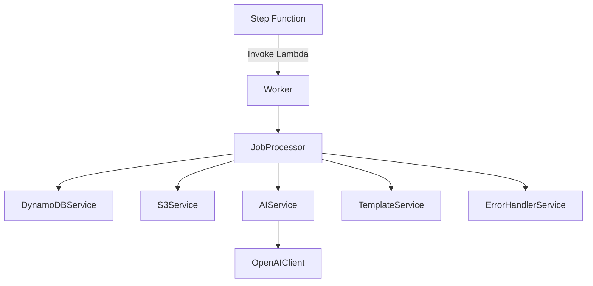
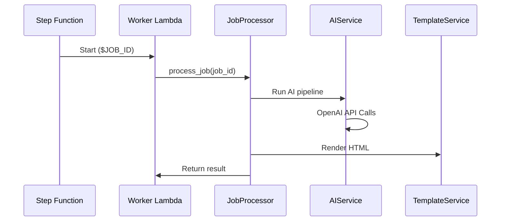

# Lead Magnet AI Worker

This directory contains the Python Lambda worker for the Lead Magnet AI Platform. The worker is responsible for processing jobs, generating AI reports, and rendering HTML templates.

## Overview

The worker is invoked with a `JOB_ID` environment variable and coordinates:
- Database operations via DynamoDB
- File storage via S3
- AI generation and HTML templating
- Error handling and notification

## Architecture Diagram

## Worker Flow Sequence

## Key Files
- `worker.py`: Entry point
- `core/`: Core service modules
- `services/`: Specialized worker services

For more info, see the code and comments in each Python file.

