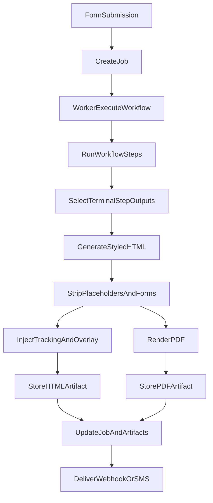

# Deliverable Generation Flow

This document explains how workflow steps, templates, and final deliverables (HTML + PDF) are produced.

## Key Concepts

- **Template HTML**: A style reference only. It defines the visual system, not the content.
- **Deliverable Content**: The output of the terminal workflow step(s) (highest `step_order`).
- **Final Deliverable**: The customer-facing artifact. It must exclude signup forms and raw step outputs.

## Current Flow

1. **Workflow steps run** and produce step outputs (research, drafts, synthesis).
2. **Terminal step outputs** (highest `step_order`) are selected as the deliverable source.
3. **Template-styled HTML** is generated using the template as a design system.
4. **Sanitization** removes template placeholders and opt-in form elements.
5. **Scripts injected** for tracking, recording, and editor overlay (HTML only).
6. **Artifacts stored**:
   - `final.html` (`html_final`)
   - `final.pdf` (`pdf_final`)
7. **Job updated** with `output_url` (HTML) and artifacts list (includes PDF).

## Flow Diagram

## Notes

- Earlier step outputs are treated as internal material and should not appear verbatim in the deliverable.
- Signup/opt-in forms are removed from the final HTML and PDF outputs.
